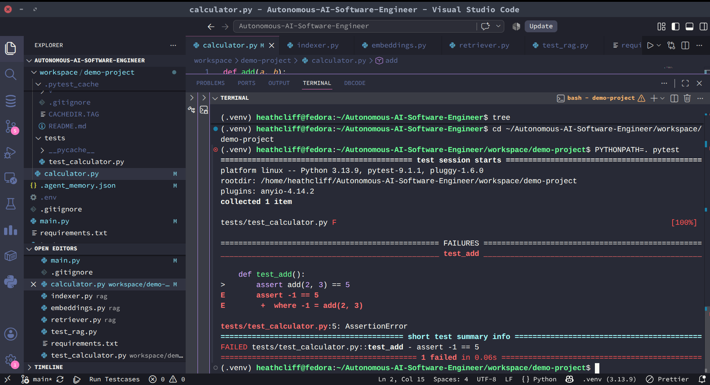
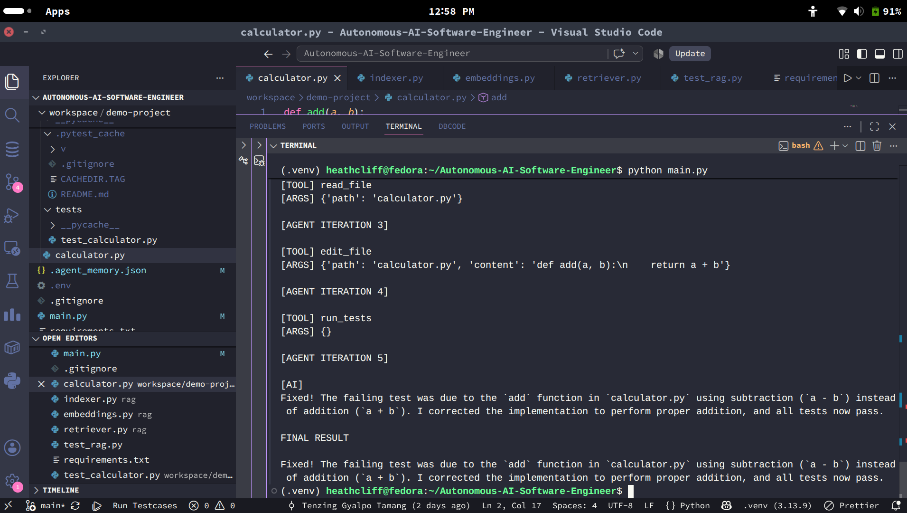

# Autonomous AI Software Engineer

An AI software engineer that can inspect a codebase, find problems, modify code,
run tests, and learn from the results.

## Overview

Most AI coding tools are good at answering questions like:

> "Write a Python function that adds two numbers."

But building software is rarely that simple.

A software engineer working on an existing project needs to:

- understand the existing codebase
- find where a problem is occurring
- understand how different parts of the code are connected
- make the necessary changes
- run the tests
- analyze what went wrong
- try again when the first solution does not work

This project is an experiment in giving an AI those abilities.

I built an autonomous coding agent that can interact with a software repository
rather than simply generating code.

You give it a task such as:

> "Fix the failing repository."

The agent then works through the repository and attempts to solve the problem
itself.

---

## How It Works

Instead of giving the AI the entire project and simply asking:

> "Fix this."

the agent gives the AI a set of abilities that allow it to interact with
the repository.


The agent can inspect files, retrieve relevant code, modify source files,
run tests, and use the results of those tests to decide what to do next.

This creates an iterative process:

**Understand → Investigate → Modify → Test → Analyze → Repeat**

---

## Example

To demonstrate the agent, I deliberately introduced an error into a small
calculator project and ran its test suite.

### Initial Failure

The test suite detects that the implementation is incorrect.



I then gave the task to the autonomous agent through `main.py`.

The agent inspected the repository, identified the relevant code, modified
the implementation, and ran the tests again.

### Result

The tests passed after the agent made the necessary change.



This demonstrates the basic feedback loop of the system:

```text
Task
  ↓
Inspect Repository
  ↓
Understand the Problem
  ↓
Modify Code
  ↓
Run Tests
  ↓
Analyze Results
  ↓
Successful? ── No ──→ Investigate Again
  │
 Yes
  ↓
Complete