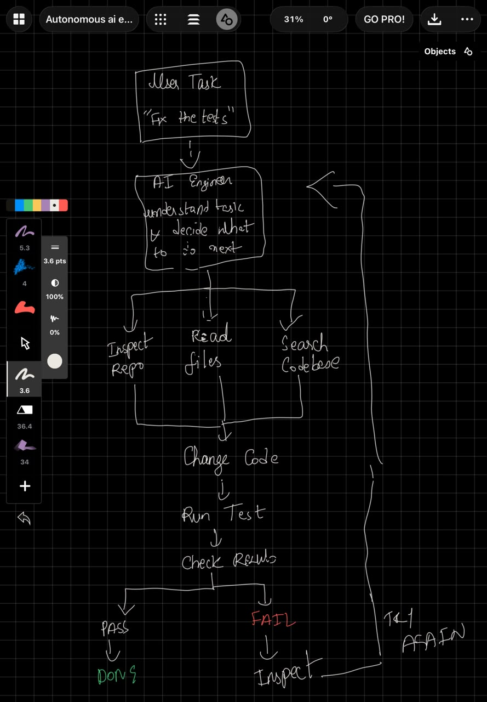
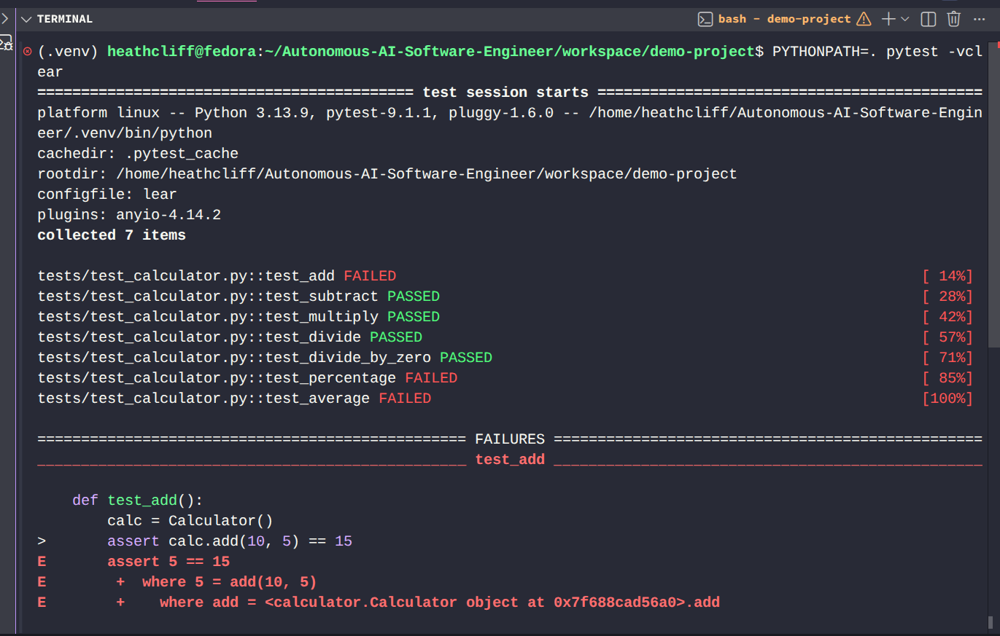
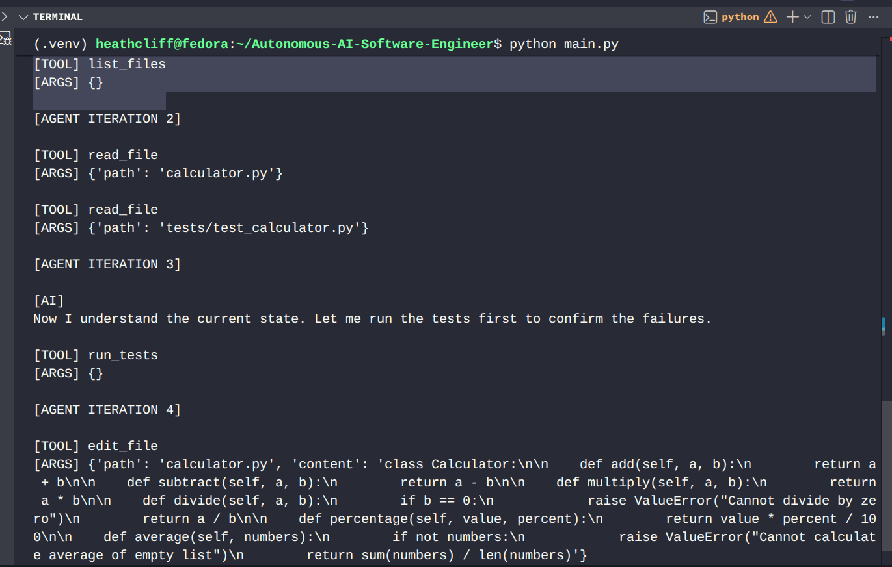
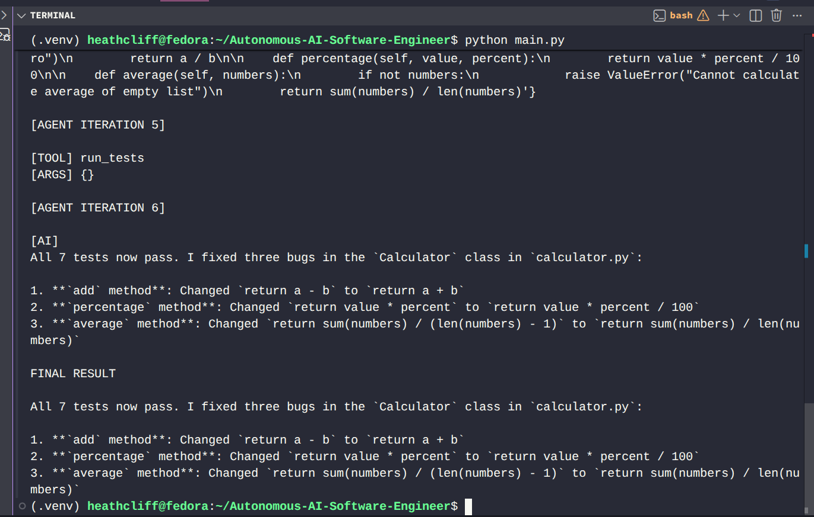
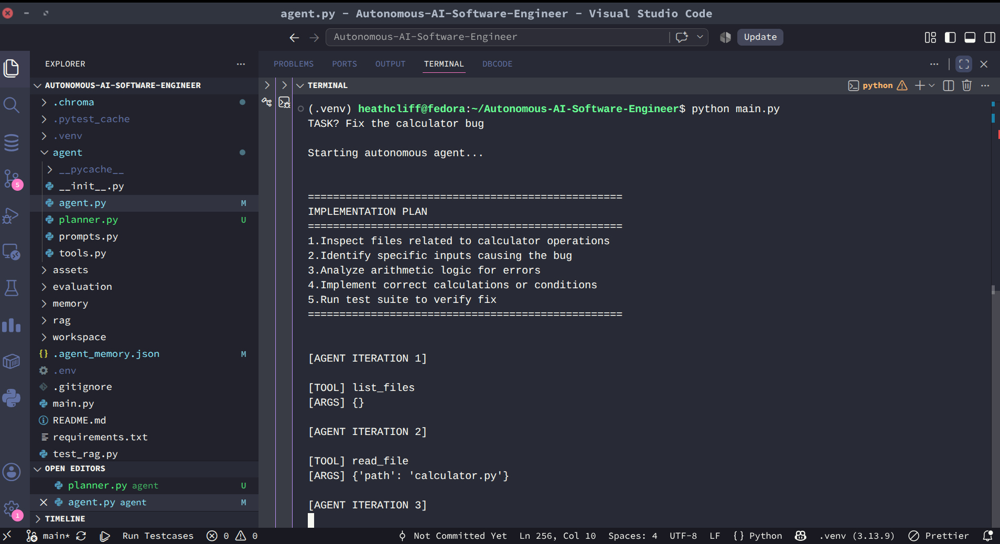
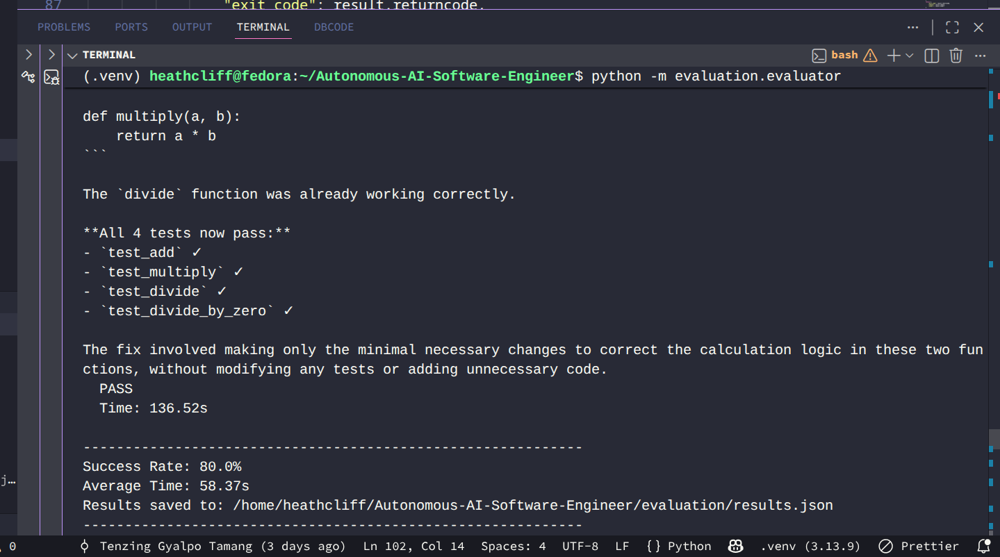

# Autonomous AI Software Engineer

An AI software engineer that can inspect a codebase, find problems, modify code,
run tests, and learn from the results.

## Overview

Most AI coding tools are good at answering questions like:

> "Write a Python function that adds two numbers."

But building software is rarely that simple.

A software engineer working on an existing project needs to:

- understand the existing codebase
- find where a problem is occurring
- understand how different parts of the code are connected
- make the necessary changes
- run the tests
- analyze what went wrong
- try again when the first solution does not work

This project is an experiment in giving an AI those abilities.

I built an autonomous coding agent that can interact with a software repository
rather than simply generating code.

You give it a task such as:

> "Fix the failing repository."

The agent then works through the repository and attempts to solve the problem
itself.

---

## How It Works

Instead of giving the AI the entire project and simply asking:

> "Fix this."

the agent gives the AI a set of abilities that allow it to interact with
the repository.



The agent can inspect files, retrieve relevant code, modify source files,
run tests, and use the results of those tests to decide what to do next.

This creates an iterative process:

**Understand → Investigate → Modify → Test → Analyze → Repeat**

---

## Example

To demonstrate the agent, I deliberately introduced an error into a small
calculator project and ran its test suite.

### Initial Failure

The test suite detects that the implementation is incorrect.



I then gave the task to the autonomous agent through `main.py`.

The agent inspected the repository, identified the relevant code, modified
the implementation, and ran the tests again.

### Result

The tests passed after the agent made the necessary change.



This demonstrates the basic feedback loop of the system:

```text
Task
  ↓
Inspect Repository
  ↓
Understand the Problem
  ↓
Modify Code
  ↓
Run Tests
  ↓
Analyze Results
  ↓
Successful? ── No ──→ Investigate Again
  │
 Yes
  ↓
Complete
```

---

## Evaluation

To evaluate the agent beyond a single demonstration, I built an automated evaluation harness that tests the agent against multiple intentionally broken repositories.

The benchmark currently covers:

- **Syntax errors**
- **Logic errors**
- **Missing functionality**
- **Multi-file repository tasks**
- **Multiple simultaneous bugs**

For each task, the evaluator creates an isolated copy of the repository, gives the task to the autonomous agent, and verifies the result by running the project's test suite.

### Evaluation Process

```text
Broken Repository
       ↓
   Agent receives task
       ↓
 Repository inspection
       ↓
 Code retrieval / search
       ↓
    Code modification
       ↓
      Run tests
       ↓
  Analyze test results
       ↓
   Fix if necessary
       ↓
     Run tests again
       ↓
    Success / Failure
```

The evaluation produces a measurable result for each task, allowing the agent's ability to autonomously diagnose and repair different classes of software issues to be tested rather than demonstrated on a single example.

### Implementation Plan
The planning stage is executed before the autonomous coding loop begins. The generated plan is displayed in the terminal and then provided to the coding agent as additional context.

For example, when given the task:

Fix the calculator bug

the planner generated:

The coding agent then follows the plan while using the repository tools:

```text
User Task
    ↓
Repository Structure
    ↓
     Planner
    ↓
Implementation Plan
    ↓
Repository Inspection
    ↓
Code Modification
    ↓
   Run Tests
    ↓
Analyze Test Results
    ↓
Fix if Necessary
    ↓
 Run Tests Again
    ↓
Success / Failure
```
This demonstrates the complete planning-to-execution workflow, where the agent first creates an implementation plan and then autonomously inspects, modifies, and validates the repository.

### Initial Benchmark Results



| Metric | Result |
|---|---:|
| Tasks evaluated | 5 |
| Successful tasks | 4 |
| Failed tasks | 1 |
| Success rate | **80%** |
| Average execution time | **58.37 seconds** |

This initial benchmark provides a baseline for measuring improvements to the agent's reasoning, retrieval, tool usage, and iterative error-recovery capabilities.
    ---

## Technology and Implementation

The project is built in Python and combines an LLM with repository tools,
code retrieval, a vector database, agent memory, and test execution.

### LLM

The agent uses an LLM as its reasoning engine.

The model receives the user's task, information retrieved from the repository,
and the results returned by the tools available to it.

I initially looked at using OpenAI's API, but API usage requires a paid
account. For this project, I used **OpenRouter** instead, which provides access
to different LLMs through a common API.

This also makes the project easier to experiment with because the underlying
model can be changed without having to redesign the rest of the agent.

### OpenRouter

OpenRouter acts as the interface between the application and the  language
model.

The basic flow is:

```text
User Task
    ↓
Coding Agent
    ↓
OpenRouter API
    ↓
LLM
    ↓
Agent Decision
    ↓
Tool Execution
    ↓
Result returned to Agent
```

The LLM does not directly modify files or execute commands.

Instead, it decides which available tool should be used. The Python
application executes that tool and returns the result to the agent.

This allows the LLM to interact with the repository through a controlled
set of operations.

---

## RAG and Vector Database

The project uses **Retrieval-Augmented Generation (RAG)** to provide the
agent with relevant information from the repository.

A coding agent cannot effectively work on a repository if it has no way of
finding the parts of the code that are relevant to the task.

Instead of sending the entire codebase to the LLM, the project first indexes
the repository and divides source files into smaller chunks.

The process is:

```text
Repository
    ↓
Find supported source files
    ↓
Split files into chunks
    ↓
Store chunks in ChromaDB
    ↓
Agent receives task
    ↓
Search for relevant code
    ↓
Retrieve relevant chunks
    ↓
Provide context to LLM
```

The vector database used in this project is **ChromaDB**.

Each indexed code chunk is stored together with metadata such as:

- file name
- starting line
- ending line
- code content

When the agent needs information about a particular part of the repository,
the retriever performs a semantic search and returns the most relevant
chunks.

This allows the agent to retrieve relevant parts of a codebase instead of
having to provide the entire repository to the LLM every time.

---

## Repository Tools

The agent is given a set of tools that allow it to interact with the
workspace.

These tools include:

### `list_files()`

Discovers the files available inside the workspace.

The tool ignores directories such as:

- `.git`
- `.venv`
- `venv`
- `__pycache__`
- `.pytest_cache`

This prevents unnecessary files from being presented to the agent.

### `read_file()`

Reads a source file from the workspace and returns its contents to the agent.

The tool also checks that the requested path remains inside the workspace,
preventing the agent from accessing files outside the repository.

### `edit_file()`

Allows the agent to modify a source file.

The agent provides the desired file content and the tool writes the updated
content to the workspace.

### `run_tests()`

Runs the repository's test suite using Pytest.

The test output, exit code, and errors are returned to the agent so that it
can determine whether its changes were successful.

Together, these tools form the interface between the LLM and the actual
software repository.

The LLM decides what action should be taken, while the Python application
actually performs that action.

---

## Test Execution and Iteration

The demonstration repository uses **Pytest** for testing.

After making a change, the agent can execute the test suite and receive the
resulting output.

The test results then become feedback for the next step:

```text
Agent makes a change
        ↓
     Run tests
        ↓
   ┌────┴────┐
   │         │
 PASS       FAIL
   │         │
   ↓         ↓
Finish    Investigate
             │
             └──────→ Try again
```

This feedback loop is one of the central ideas behind the project.

The agent is not simply asked to generate a solution once. It can observe
the result of its actions and use that information when deciding what to
do next.

---

## Agent Memory

The project also contains a memory component for storing information about
agent executions.

The memory system provides a foundation for retaining information from
previous executions.

The idea is to eventually allow the agent to retain useful information about:

- previous attempts
- successful solutions
- failed approaches
- repository-specific information
- useful patterns discovered during previous tasks

The current implementation provides the foundation for this system, with
future improvements planned around making the stored information more useful
to subsequent tasks.

---

## Project Structure

```text
Autonomous-AI-Software-Engineer/
│
├── agent/
│   ├── agent.py
│   ├── prompts.py
│   └── tools.py
│
├── rag/
│   ├── embeddings.py
│   ├── indexer.py
│   └── retriever.py
│
├── memory/
│   └── memory.py
│
├── workspace/
│   └── demo-project/
│       ├── calculator.py
│       └── tests/
│           └── test_calculator.py
│
├── main.py
├── requirements.txt
├── test_rag.py
└── README.md
```

### `agent/`

Contains the main autonomous coding agent, prompts, and repository tools.

### `agent.py`

Contains the main agent logic responsible for receiving a task, interacting
with the available tools, and coordinating the coding workflow.

### `tools.py`

Contains the tools through which the agent interacts with the repository.

### `prompts.py`

Contains the instructions and prompts provided to the LLM.

### `rag/`

Contains the repository indexing and retrieval system.

### `indexer.py`

Searches the workspace for supported source files, divides them into chunks,
and stores those chunks in the vector database.

### `retriever.py`

Performs semantic searches against the indexed code and returns relevant
code chunks together with their file and line information.

### `embeddings.py`

Contains the embedding-related functionality used by the retrieval system.

### `memory/`

Contains the agent memory implementation.

### `workspace/`

Contains the repository that the autonomous agent operates on.

The current demonstration uses a small calculator project so that the
agent's behavior can be easily observed.

### `main.py`

The entry point used to start the autonomous coding agent and provide it
with a software-engineering task.

---

## Running the Project

Clone the repository:

```bash
git clone https://github.com/Tachhen/Autonomous-AI-Software-Engineer.git
cd Autonomous-AI-Software-Engineer
```

Create and activate a Python virtual environment:

```bash
python -m venv .venv
source .venv/bin/activate
```

Install the dependencies:

```bash
pip install -r requirements.txt
```

Create a `.env` file and add your OpenRouter API key:

```text
OPENROUTER_API_KEY=your_api_key_here
```

Then start the agent:

```bash
python main.py
```

The program will ask:

```text
What should the AI engineer do?
```

You can provide a task such as:

```text
Fix the failing tests in the repository.
```

The agent will then begin interacting with the workspace and attempting to
complete the task.

---

## What I Built This To Explore

This project started as an experiment to understand what is required to move
from a simple LLM-based coding assistant toward an autonomous software
engineering system.

The interesting part for me was not simply getting an LLM to generate code.

It was building the surrounding system that allows the model to:

**understand a task → access information → use tools → change the environment
→ observe the result → and decide what to do next.**

Building this project gave me hands-on experience with the different
components required to create an autonomous coding workflow and, more
importantly, how those components need to work together.

---

## Future Improvements

There are several areas I would like to explore as the project develops:

- Better repository-level code understanding
- Improved code chunking and retrieval
- More robust agent memory
- Better handling of large repositories
- Git integration
- Automatic branch creation
- Pull request generation
- Better validation of generated changes
- Human approval checkpoints before potentially destructive changes
- Support for additional programming languages
- More comprehensive evaluation of agent performance

---

## Status

This is an experimental project and an ongoing learning exercise.

The current implementation demonstrates the core autonomous coding loop:

**Repository inspection → Code retrieval → Tool usage → Code modification →
Test execution → Iterative problem solving**

The project is intentionally being developed incrementally, with the goal of
understanding not only how to make an LLM generate code, but how to build the
systems around it that allow an AI agent to interact with and reason about
an existing software project.